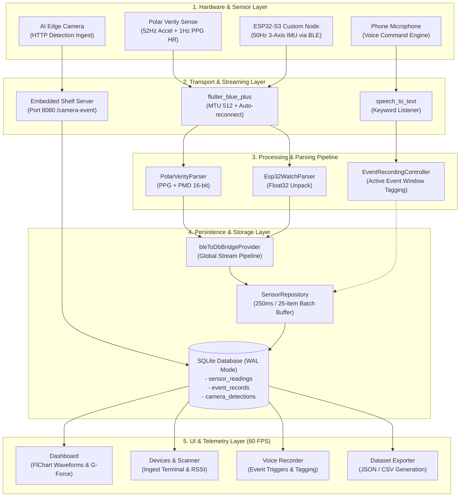

# 🏍️ Ride Sensor Capture & ML Telemetry Platform

An ultra-low-latency, multi-sensor data capture and dataset labeling application built with **Flutter**, **Drift (SQLite WAL)**, **Flutter Riverpod**, and **Bluetooth Low Energy (BLE)**.

Designed for machine learning researchers and embedded developers collecting time-synchronized vehicle dynamics, rider biomechanics, and vision telemetry for training road surface, rider behavior, and vehicle maneuver classification models.

---

## 📑 Table of Contents
1. [System Architecture & Data Flow](#-system-architecture--data-flow)
2. [Key Features](#-key-features)
3. [Project Directory Structure](#-project-directory-structure)
4. [Hardware & Communication Protocols](#-hardware--communication-protocols)
   - [Polar Verity Sense (Optical PPG & IMU)](#1-polar-verity-sense-optical-ppg--imu)
   - [ESP32-S3 Custom Watch / IMU Node](#2-esp32-s3-custom-watch--imu-node)
   - [AI Camera Ingestion Webhook](#3-ai-camera-ingestion-webhook)
5. [Database Schema & Persistence Pipeline](#-database-schema--persistence-pipeline)
6. [Prerequisites & Development Setup](#-prerequisites--development-setup)
7. [Running the Application](#-running-the-application)
8. [Testing & Verification](#-testing--verification)
9. [Dataset Export Formats (PyTorch / TensorFlow)](#-dataset-export-formats-pytorch--tensorflow)
10. [Platform Permissions & Manifest Setup](#-platform-permissions--manifest-setup)

---

## 🏗️ System Architecture & Data Flow

The platform coordinates multiple high-frequency data streams simultaneously with zero UI thread stutter:



---

## ⚡ Key Features

* **Multi-Device BLE Synchronization**: Connects concurrently to Polar Verity Sense sensors and ESP32 nodes with automatic 512-byte MTU negotiation.
* **Resilient Connection Lifecycle**: Auto-reconnect with exponential backoff (2s, 4s, 8s, 16s, up to 20s) and a continuous 1500ms link health heartbeat monitor.
* **Crash-Safe SQLite WAL Storage**: Ingests 50Hz streams using an in-memory batch buffer committed every 250ms with zero database write locks.
* **Monotonic Sequence Indexing**: Maintains persistent per-device sequence counters (`sequenceNo`) that resume smoothly across restarts and disconnects.
* **Hands-Free Voice Event Tagging**: Start and stop labeled event windows (bumps, sharp turns, speed tests) while riding using speech keywords.
* **Embedded AI Camera Server**: Built-in HTTP server (`Shelf`) listening for real-time edge vision detections from microcontrollers or Raspberry Pi over local Wi-Fi.
* **High-Performance 60 FPS Telemetry**: Optimized `FlChart` waveforms isolated with `RepaintBoundary` and zero animation duration to eliminate UI jank.
* **Direct ML Dataset Export**: Exports time-aligned telemetry with active event labels into structured JSON and CSV formats.

---

## 📁 Project Directory Structure

```text
lib/
├── app.dart                        # Root MaterialApp, navigation shell, and global permission prompts
├── main.dart                       # App entry point (WidgetsFlutterBinding & runApp)
│
├── ble/                            # Bluetooth Low Energy Subsystem
│   ├── models/
│   │   ├── ble_device_model.dart   # BleDeviceModel, DeviceType, ConnectionHealth, BleConnectionState
│   │   └── raw_sensor_data.dart    # Structured sensor reading model (HR, Accel, PPI, Gyro)
│   ├── parsers/
│   │   ├── polar_verity_parser.dart # GATT 0x2A37 (HR/PPI) & Polar PMD 0xFB005C82 Accel unpacker
│   │   └── esp32_watch_parser.dart  # Custom 13-byte byte buffer & float32 parser
│   └── services/
│       ├── ble_scanner.dart         # BLE advertisement scanner & bonded device discovery
│       ├── ble_connection_manager.dart # Connection lifecycle, MTU, auto-reconnect & packet stream
│       └── ble_permission_service.dart # Platform-specific BLE permission request handlers
│
├── camera/                         # Embedded AI Camera Module Ingestion
│   ├── camera_detection_model.dart # Detection bounding box and confidence payload models
│   ├── camera_detection_repository.dart # Drift persistence interface for camera frames
│   └── camera_ingest_server.dart   # Shelf HTTP REST server on port 8080 (/camera-event)
│
├── voice/                          # Speech Recognition & Voice Commands
│   ├── voice_command_config.dart   # Voice triggers ("start bump", "start turn", "stop event")
│   └── voice_command_listener.dart # Continuous speech listener wrapping speech_to_text
│
├── data/                           # Data Persistence Layer
│   ├── local_db/
│   │   ├── connection/             # Native (sqlite3) and Web database factory connectors
│   │   ├── tables/
│   │   │   ├── sensor_readings_table.dart  # Time-series IMU & HR records with eventId foreign key
│   │   │   ├── event_records_table.dart    # Labeled event windows with start/end timestamps
│   │   │   └── camera_detections_table.dart# Vision inference results
│   │   ├── database.dart           # Drift @DriftDatabase schema and migrations
│   │   └── database.g.dart         # Drift generated DAO and companion types
│   ├── models/
│   │   └── event_parameters.dart   # Bump, Turn, and Speed test physics parameter models
│   └── repositories/
│       ├── sensor_repository.dart  # SensorRepository interface
│       ├── sensor_repository_impl.dart # Batch buffered SQLite repository with in-memory caching
│       ├── export_repository.dart  # Export repository interface
│       └── export_repository_impl.dart # JSON and CSV dataset generation engine
│
├── features/                       # Presentation Screens & UI Feature Modules
│   ├── dashboard/                  # Live 50Hz waveform telemetry & G-Force dashboard
│   ├── devices/                    # BLE scanner, hardware cards & live ingest terminal
│   ├── events/                     # Voice-triggered ride labeling & event history detail
│   └── export/                     # ML Dataset export configurations & share sheet
│
├── providers/                      # Riverpod Dependency Injection & State Providers
│   ├── ble_providers.dart          # Scanner, connection manager, and raw sensor streams
│   ├── db_providers.dart           # Database, repository, and BLE-to-DB bridge providers
│   ├── dashboard_providers.dart    # Rolling telemetry state notifier (8 FPS throttled)
│   ├── camera_providers.dart       # Camera server state and recent detection streams
│   ├── battery_providers.dart      # Device battery level and power mode providers
│   └── export_providers.dart       # Dataset generation controller and filter state
│
└── core/                           # Shared Theme, Constants, and System Services
    ├── services/
    │   ├── app_permissions_service.dart # Cold-start hardware permissions checker
    │   ├── battery_service.dart    # Battery drainage estimator
    │   └── session_health_service.dart  # Hardware alerts and packet gap monitor
    └── theme/
        └── app_theme.dart          # Dark glassmorphic color palette and styling tokens
```

---

## 📡 Hardware & Communication Protocols

### 1. Polar Verity Sense (Optical PPG & IMU)
* **Standard Heart Rate (PPG)**:
  * **Service UUID**: `0x180D` (Standard Heart Rate Service)
  * **Characteristic UUID**: `0x2A37` (Heart Rate Measurement)
  * **Payload**: Flags byte + uint8/uint16 BPM + uint16 RR-interval (PPI calculated as $\frac{\text{RR}}{1024} \times 1000\,\text{ms}$).
* **Polar Measurement Data (PMD Accelerometer)**:
  * **PMD Service UUID**: `fb005c80-02e7-f38b-9d58-b8c9f0f23d58`
  * **Control Point**: `fb005c81-02e7-f38b-9d58-b8c9f0f23d58`
  * **Data Stream**: `fb005c82-02e7-f38b-9d58-b8c9f0f23d58`
  * **Start Command**: `[0x02, 0x02, 0x00, 0x01, 0x34, 0x00, 0x01, 0x01, 0x10, 0x00, 0x02, 0x01, 0x08, 0x00]` (Requests 52Hz 8G 3-axis accelerometer streaming).

### 2. ESP32-S3 Custom Watch / IMU Node
* **Service UUID**: `0xFFE0`
* **Data Characteristic**: `0xFFE1` (Notify)
* **Binary Payload Structure (13 Bytes)**:
  | Offset | Length | Type | Description |
  |---|---|---|---|
  | `0` | 1 byte | `uint8` | Heart Rate (BPM) |
  | `1` | 4 bytes | `float32 (little-endian)` | Accelerometer X ($\text{m/s}^2$) |
  | `5` | 4 bytes | `float32 (little-endian)` | Accelerometer Y ($\text{m/s}^2$) |
  | `9` | 4 bytes | `float32 (little-endian)` | Accelerometer Z ($\text{m/s}^2$) |

### 3. AI Camera Ingestion Webhook
The app runs an internal HTTP server accessible on the phone's local network at `http://<phone-ip>:8080/camera-event`.

**Sample Ingest Payload (`POST /camera-event`)**:
```json
{
  "device_id": "esp32_cam_01",
  "timestamp_utc": "2026-08-25T10:55:00.000Z",
  "event_class": "pothole",
  "confidence": 0.94,
  "bounding_box": [120, 80, 240, 180],
  "latency_ms": 42
}
```

---

## 🗄️ Database Schema & Persistence Pipeline

All tables are managed by **Drift** backed by SQLite in **Write-Ahead Logging (WAL)** mode.

### `sensor_readings` Table
| Column | Type | Constraints | Description |
|---|---|---|---|
| `id` | `INTEGER` | Primary Key, Auto Increment | Unique record ID |
| `deviceId` | `TEXT` | NOT NULL | Device MAC or UUID |
| `deviceType` | `TEXT` | NOT NULL | `verityBand`, `watch`, `camera` |
| `sequenceNo` | `INTEGER` | NOT NULL | Monotonic counter per device |
| `timestampUtc` | `DATETIME` | NOT NULL | UTC packet arrival timestamp |
| `sensorType` | `TEXT` | NOT NULL | `hr`, `imu`, `combined`, `ppi` |
| `eventId` | `INTEGER` | Nullable, Indexed | Foreign key to active `event_records.id` |
| `heartRate` | `INTEGER` | Nullable | BPM |
| `accelX` | `REAL` | Nullable | X acceleration in $\text{m/s}^2$ |
| `accelY` | `REAL` | Nullable | Y acceleration in $\text{m/s}^2$ |
| `accelZ` | `REAL` | Nullable | Z acceleration in $\text{m/s}^2$ |
| `gyroX` | `REAL` | Nullable | X angular velocity in $\text{rad/s}$ |
| `gyroY` | `REAL` | Nullable | Y angular velocity in $\text{rad/s}$ |
| `gyroZ` | `REAL` | Nullable | Z angular velocity in $\text{rad/s}$ |
| `ppiMs` | `INTEGER` | Nullable | Peak-to-peak cardiac interval |
| `rawPayload` | `TEXT` | Nullable | Raw byte buffer backup |

---

## 🛠️ Prerequisites & Development Setup

### Requirements
* **Flutter SDK**: `>= 3.24.0` (Dart `>= 3.5.0`)
* **Android Studio / Xcode** with Android SDK 34+ / iOS 15+
* **Physical Device** recommended for Bluetooth Low Energy testing (simulators lack full BLE central radios).

### Step-by-Step Setup

1. **Clone the Repository**:
   ```bash
   git clone https://github.com/your-username/ride_sensor_capture.git
   cd ride_sensor_capture
   ```

2. **Install Flutter Dependencies**:
   ```bash
   flutter pub get
   ```

3. **Generate Drift Database Code**:
   ```bash
   dart run build_runner build --delete-conflicting-outputs
   ```

4. **Verify Analysis & Test Suite**:
   ```bash
   flutter analyze
   flutter test
   ```

---

## 🚀 Running the Application

### Running on a Connected Android / iOS Device
```bash
flutter run
```

### Running with Release Performance Mode
```bash
flutter run --release
```

---

## 🧪 Testing & Verification

The repository contains 34 automated unit and integration tests covering:
* BLE parsing and model validation
* Monotonic sequence number continuation across database reconnects
* Camera detection payload verification and bounds checking
* Drift database batch persistence
* ML JSON and CSV dataset export formatting

Execute the test suite with:
```bash
flutter test
```

---

## 📦 Dataset Export Formats (PyTorch / TensorFlow)

The Export screen allows researchers to export collected rides into formats ready for Python data pipelines:

### 1. JSON Export Schema (`.json`)
```json
{
  "export_version": "1.0",
  "generated_at_utc": "2026-08-25T11:00:00.000Z",
  "mode": "events_only",
  "events": [
    {
      "id": 1,
      "event_type": "bump",
      "start_timestamp_utc": "2026-08-25T10:55:10.000Z",
      "end_timestamp_utc": "2026-08-25T10:55:14.200Z",
      "trigger_phrase": "start bump",
      "computed_parameters": {
        "bump": { "peak_g_force": 2.84, "duration_ms": 4200 }
      },
      "sensor_readings": [
        {
          "seq": 1042,
          "device_id": "C8:3F:2A:11:22:33",
          "timestamp_utc": "2026-08-25T10:55:10.020Z",
          "hr": 132,
          "accel_x": 0.42,
          "accel_y": -1.18,
          "accel_z": 12.45
        }
      ],
      "camera_detections": []
    }
  ]
}
```

### 2. Time-Series CSV Export Schema (`.csv`)
```csv
id,device_id,device_type,sequence_no,timestamp_utc,sensor_type,event_id,heart_rate,accel_x,accel_y,accel_z,gyro_x,gyro_y,gyro_z,ppi_ms
1,C8:3F:2A:11:22:33,verityBand,1042,2026-08-25T10:55:10.020Z,combined,1,132,0.42,-1.18,12.45,,,465
```

---

## 🔒 Platform Permissions & Manifest Setup

### Android (`android/app/src/main/AndroidManifest.xml`)
* `android.permission.BLUETOOTH_SCAN`
* `android.permission.BLUETOOTH_CONNECT`
* `android.permission.ACCESS_FINE_LOCATION`
* `android.permission.RECORD_AUDIO`
* `android.permission.FOREGROUND_SERVICE`
* `android.permission.WAKE_LOCK`

### iOS (`ios/Runner/Info.plist`)
* `NSBluetoothAlwaysUsageDescription`
* `NSBluetoothPeripheralUsageDescription`
* `NSLocationWhenInUseUsageDescription`
* `NSLocationAlwaysAndWhenInUseUsageDescription`
* `NSMicrophoneUsageDescription`
* `NSSpeechRecognitionUsageDescription`

---

## 👨‍💻 Contributing

1. Create a feature branch: `git checkout -b feature/new-sensor-protocol`
2. Commit your changes: `git commit -m "feat: add support for Garmin BLE cadence protocol"`
3. Run tests and static analysis: `flutter test && flutter analyze`
4. Push to the branch: `git push origin feature/new-sensor-protocol`
5. Open a Pull Request.

---

## 📄 License
This project is private and intended for research & development.
